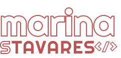

 <br/>
[](https://forthebadge.com)
[](https://forthebadge.com)
# Welcome to my portfolio

Here's the repository of my [portfolio](marinastavares.dev). It was done with the full stack web framework Remix.
- [Remix Docs](https://remix.run/docs)

## Development

From your terminal:

```sh
npm run dev
```

This starts your app in development mode, rebuilding assets on file changes.

## Deployment

First, build your app for production:

```sh
npm run build
```

Then run the app in production mode:

```sh
npm start
```
